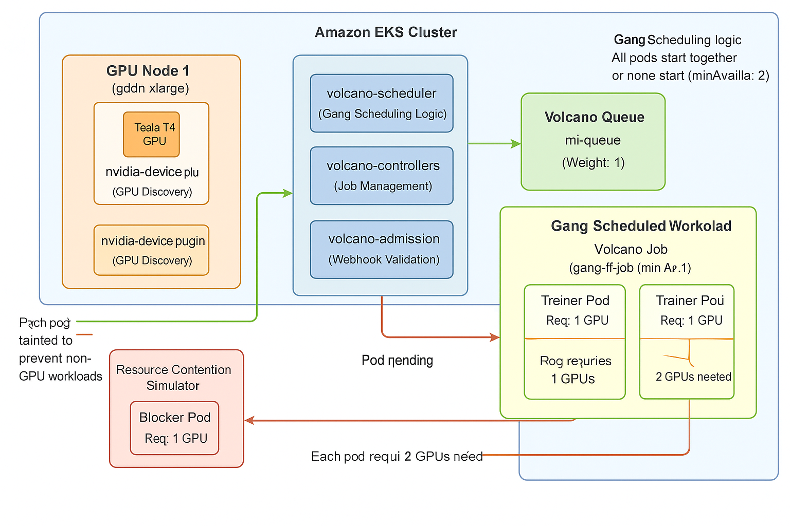

# NVIDIA GPU Volcano Kubernetes Batch Jobs

⚠️ COST WARNING: 

This demo uses 2x g4dn.xlarge GPU instances (~$0.53/hour each). Always delete node group after testing to avoid unexpected charges. Demo should complete in ~30 minutes for ~$0.32 total cost.

💡 COST TIPS:

Use spot instances for 60-70% savings
Scale down to 0 nodes immediately after demo
Set up billing alerts before running
Delete resources promptly - GPU instances are expensive!

## Architecture Diagram


---

## Project Overview

Minimal demo to showcase **gang scheduling** using [Volcano](https://volcano.sh/en/) on Kubernetes. Runs a lightweight TensorFlow job that requires multiple pods to start together across GPU nodes.

## ✅ Features

* Gang scheduling with `minAvailable: 2` across 2 GPU nodes
* Runs on `g4dn.xlarge` GPU instances with Tesla T4
* Simulates resource contention to demonstrate blocking behavior
* Enhanced logging with comprehensive system and GPU information
* S3 integration for training logs and metadata
* Complete run under 15 minutes and ~$0.10 (2x spot instances)

## 📁 Structure

```
.
├── Dockerfile
├── model/
│   └── train.py              # Enhanced training with S3 logging
├── manifests/
│   ├── gpu-node-setup.sh     # Standard GPU node configuration
│   ├── tensorflow-job.yaml   # Gang scheduled TensorFlow job
│   ├── volcano-queue.yaml    # Volcano queue for ML workloads
│   └── gpu-blocker-pod.yaml  # Resource contention simulator
└── README.md
```

## 🚀 Setup and Demo

### Prerequisites
- EKS cluster with kubectl configured
- Helm v3 installed

### 1. Provision GPU Nodes
```bash
# Create GPU node group (modify cluster name and region)
eksctl create nodegroup \
  --cluster <your-cluster-name> \
  --region <your-region> \
  --name gpu-spot \
  --node-type g4dn.xlarge \
  --nodes 2 \
  --nodes-min 0 \
  --nodes-max 4 \
  --spot \
  --node-ami-family AmazonLinux2 \
  --node-ami AL2_x86_64_GPU
```

### 2. Install GPU Support
```bash
# Install NVIDIA device plugin
kubectl apply -f https://raw.githubusercontent.com/NVIDIA/k8s-device-plugin/v0.14.1/nvidia-device-plugin.yml

# Setup GPU node taints using standard NVIDIA conventions
chmod +x manifests/gpu-node-setup.sh
./manifests/gpu-node-setup.sh

# Verify GPU detection
kubectl get nodes -o custom-columns=NAME:.metadata.name,GPU:.status.allocatable.'nvidia\.com/gpu'
```

### 3. Install Volcano
```bash
# Add Volcano helm repository
helm repo add volcano-sh https://volcano-sh.github.io/helm-charts
helm repo update

# Install Volcano scheduler
helm install volcano volcano-sh/volcano -n volcano-system --create-namespace

# Verify installation
kubectl get pods -n volcano-system
```

### 4. Run Gang Scheduling Demo
```bash
# Create Volcano queue for ML workloads
kubectl apply -f manifests/volcano-queue.yaml

# Deploy gang scheduled job (both pods should start together)
kubectl apply -f manifests/tensorflow-job.yaml

# Watch gang scheduling in action
kubectl get pods -l volcano.sh/job-name=gang-tf-job -w
kubectl get pods -l volcano.sh/job-name=gang-tf-job -o wide
```

### 5. Demonstrate Resource Contention
```bash
# Clean up first run
kubectl delete -f manifests/tensorflow-job.yaml

# Deploy GPU blocker to occupy 1 GPU
kubectl apply -f manifests/gpu-blocker-pod.yaml

# Wait for blocker to start
kubectl get pods blocker -w

# Deploy gang job (should stay Pending - only 1 GPU available, needs 2)
kubectl apply -f manifests/tensorflow-job.yaml

# Observe gang scheduling blocking behavior
kubectl get pods -l volcano.sh/job-name=gang-tf-job -w
kubectl describe job.batch.volcano.sh gang-tf-job

# Delete blocker to release GPU resources
kubectl delete pod blocker

# Watch both pods start simultaneously
kubectl get pods -l volcano.sh/job-name=gang-tf-job -w
```

### 6. Monitor Training Results
```bash
# View training logs with GPU information
kubectl logs -l volcano.sh/job-name=gang-tf-job --all-containers=true

# Check individual pod logs
kubectl logs gang-tf-job-trainer-0
kubectl logs gang-tf-job-trainer-1

# Monitor Volcano job status
kubectl get jobs.batch.volcano.sh gang-tf-job
kubectl describe job.batch.volcano.sh gang-tf-job
```

## 🧹 Cleanup

```bash
# Delete Volcano resources
kubectl delete -f manifests/

# Remove GPU node taints (optional)
for node in $(kubectl get nodes --no-headers | grep g4dn | awk '{print $1}'); do
  kubectl taint nodes $node nvidia.com/gpu=present:NoSchedule-
done

# Scale down GPU node group to save costs
eksctl scale nodegroup --cluster <cluster-name> --name gpu-spot --nodes 0

# Uninstall Volcano (optional)
helm uninstall volcano -n volcano-system
```

## 📊 Expected Results

### Gang Scheduling Success



```bash
NAME                    READY   STATUS      RESTARTS   AGE
gang-tf-job-trainer-0   0/1     Completed   0          3m46s
gang-tf-job-trainer-1   0/1     Completed   0          3m46s
```

## Terminal view


### Training Performance
- **Duration**: ~3.5 seconds for 5 epochs
- **GPU**: Tesla T4 with 13.9GB memory per pod
- **Loss Convergence**: 0.0974 → 0.0840
- **Device**: Training runs on `/GPU:0` with CUDA acceleration

### System Information Logged
- AWS instance metadata (g4dn.xlarge, region, AZ)
- GPU specifications and utilization  
- Kubernetes pod and node details
- Training metrics and performance data
- Resource limits and allocation

## 🛠️ Troubleshooting

### GPU Not Detected
```bash
# Check device plugin logs
kubectl logs -n kube-system -l name=nvidia-device-plugin-ds

# Verify GPU nodes have correct AMI
kubectl get nodes -o wide | grep g4dn
```

### Gang Job Pending
```bash
# Check scheduling events
kubectl get events --sort-by='.lastTimestamp' | grep gang-tf-job

# Verify GPU availability
kubectl describe nodes | grep nvidia.com/gpu

# Check Volcano scheduler logs
kubectl logs -n volcano-system -l app=volcano-scheduler
```

## 💰 Cost Analysis

* **Instance Type**: 2x g4dn.xlarge spot instances
* **Spot Price**: ~$0.33/hour per instance
* **Demo Duration**: ~15 minutes
* **Total Cost**: **~$0.16** (very cost-effective)
* **EKS Control Plane**: $0.10/hour

## 🎯 Key Learnings

1. **Gang Scheduling**: Ensures all pods start together or not at all
2. **Resource Efficiency**: Prevents partial deployments and resource waste
3. **Multi-node Coordination**: Distributes GPU workloads across nodes
4. **Cost Optimization**: Spot instances provide significant savings
5. **Comprehensive Logging**: Detailed system and training metrics captured